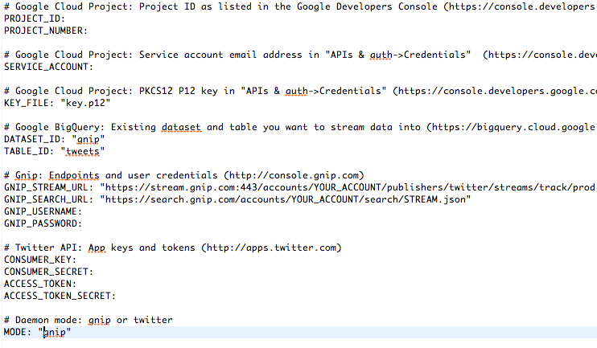

Twitter for BigQuery
===

This sample code will help you streaming Twitter data into BigQuery, and running simple visualizations. This sample also generates the queries you can run directly in the BigQuery interface, or extend for your applications.

Additionally, you can use other public or private datasets in BigQuery to do additional joins and developer othe insights/correlations.

Requirements
---

- This sample code (http://github.com/twitterdev/twitter-for-bigquery)
- Twitter App (http://apps.twitter.com)
- Google Cloud account 
- Google BigQuery account
- Google AppEngine (GAE) Launcher (???)

Configuration
---

To work with Google Cloud and BigQuery, follow the below instructions:

- Go to http://console.developers.google.com
- Create a Project
- Open "APIs & auth->Credentials"
- Note your Service Account email (Under "EMAIL ADDRESS")
- Generate and store your P12 key
- Convert the P12 key to a PEM file with the following:

	`cat key.p12 | openssl pkcs12 -nodes -nocerts -passin pass:notasecret | openssl rsa > key.pem`

Loading Twitter data into BigQuery
---

The enclosed sample includes a simple `load.py` file to stream Tweets directly into BigQuery.

- Copy `config.py.dist` to `config.py`
- Fill out the following fields:

	
	
- Run `python load.py` 

Running the app
---

### Running locally from command line

From the command line, you can use dev_appserver.py to run your local server. You'll need to specify your service account and private key file on the command line, as such:

	`dev_appserver.py . --appidentity_email_address="YOUR_TOKEN@developer.gserviceaccount.com" --appidentity_private_key_path=/PATH/TO/key.pem`
	
Once this is complete, open your browser to http://localhost:8080.

### Running locally from the GAE Launcher

To set up the app using the GAE Launcher, do the following:

- Open the GAE Launcher.
- Click on "File->New Application".
- Specify the application ID (twitter-for-bigquery) and application directory (path where twitter-for-bigquery exists). 
- Click "Save".
- Select the Application in the list and click on "Edit->Application Settings".

- In the "Extra Flags" section, add the command line flags, as above:

	`--appidentity_email_address="YOUR_TOKEN@developer.gserviceaccount.com" --appidentity_private_key_path=/PATH_TO/key.pem`
	

- Click "Update".
- Click "Run".
- Open your browser to http://localhost:8080.

Running on Google AppEngine
---

To run in Google AppEngine, you first need to have it running from the GAE console. (See instructions above.) 

Once this is complete, you can click on "Deploy" to deploy it to the cloud.

To confirm the deploy worked, you can do the following to view the logs:

- Open a browser to https://appengine.google.com
- Click on "Logs" to the left
- Find the entry with an orange "E" (for Error) and click on the "+" to expand it

The dataset
---

### Schema

The `load.py` file takes tweets and loads them one-by-one into BigQuery. Some basic scrubbing of the data is done to simplify the dataset. (For more information, view the `Utils.scrub()` function.) 

 JSON files are provided in `/data` as samples of the data formats from Twitter and stored into BigQuery.

- `sample_stream.jsonr` - Small sample of Twitter Stream, written to file
- `sample_tweet_cleaned.json` - Tweet from stream, but scrubbed to be consistent with BigQuery/schema.json
- `sample_tweet.json` - Tweet from stream 
- `schema.json` - Tweet representation as BigQuery table schema

### Sample queries

To help you get started, below are some sample queries.

##### Text search

Querying for tweets contain a specific word or phrase.

	SELECT text FROM [tweets.2015_01_09] WHERE text CONTAINS ' something ' LIMIT 10

##### #Hashtag search

Searching for specific hashtags.

	SELECT entities.hashtags.text, HOUR(TIMESTAMP(created_at)) AS create_hour, count(*) as count FROM [tweets.2015_01_09] WHERE LOWER(entities.hashtags.text) in ('John', 'Paul', 'George', 'Ringo') GROUP by create_hour, entities.hashtags.text ORDER BY entities.hashtags.text ASC, create_hour ASC

##### Tweet source

Listing the most popular Twitter applications.

    SELECT source, count(*) as count FROM [tweets.2015_01_09] GROUP by source ORDER BY count DESC LIMIT 1000

##### Media/URLs shared

Finding the most popular content shared on Twitter.

	SELECT text, entities.urls.url FROM [tweets.2015_01_09] WHERE entities.urls.url IS NOT NULL LIMIT 10

##### User activity

Users that tweet the most.

	SELECT user.screen_name, count(*) as count FROM [tweets.2015_01_09] GROUP BY user.screen_name ORDER BY count DESC LIMIT 10
	
To learn more about querying, go to https://cloud.google.com/bigquery/query-reference

Going further
---

Using BigQuery allows you to combine Twitter data with other public sources of information. Here are some ideas to inspire your next project:

- Perform and store sentiment analysis on tweet text for worldwide sentiment
- Cross reference 
- ???

For a list of interesting and recent publicly available sources, please visit:

???

You can also visit http://demo.redash.io/ to perform queries and visualizations against publicly available data sources.

Additional reading
---

The following documents serve as additional information on streaming data from Twitter and working with BigQuery.

- *How to stream data from Twitter with tweepy [Python]:* http://runnable.com/Us9rrMiTWf9bAAW3/how-to-stream-data-from-twitter-with-tweepy-for-python
- *Authorizing Access to the Google BigQuery API using OAuth 2.0:* https://cloud.google.com/bigquery/authorization
- *Codelab: Creating a BigQuery Dashboard:* https://cloud.google.com/bigquery/articles/dashboard#newappengineproject
- *Uploading Your Application:* https://cloud.google.com/appengine/docs/python/gettingstartedpython27/uploading
- *Data Visualization App Using GAE Python, D3.js and Google BigQuery:* http://code.tutsplus.com/tutorials/data-visualization-app-using-gae-python-d3js-and-google-bigquery--cms-22175

Credits
---

The following developers and bloggers have aided greatly in the development of this source. I'm  appreciative of contributions and knowledge sharing.

- @felipehoffa - https://github.com/felipehoffa
- @tyler_treat - https://github.com/tylertreat/BigQuery-Python/
- @apassant - https://github.com/apassant
- @jay3dec - https://twitter.com/jay3dec

