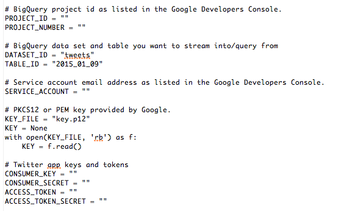
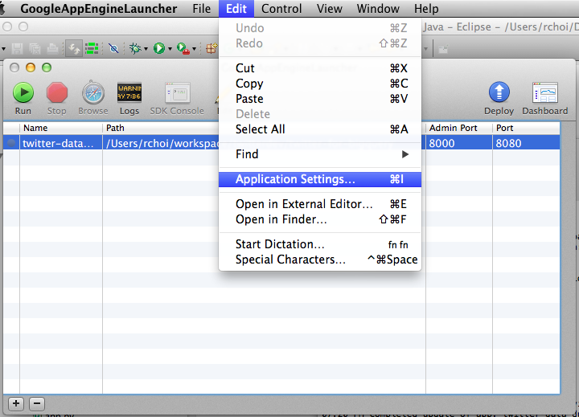
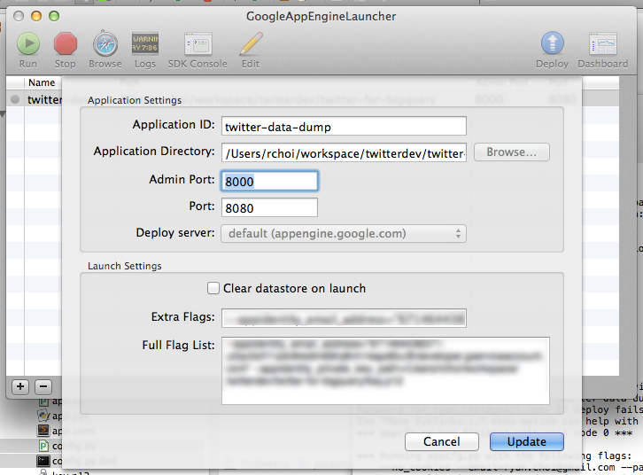

Twitter for BigQuery
===

This sample code will help you streaming Twitter data into BigQuery, and running simple visualizations. This sample also generates the queries you can run directly in the BigQuery interface, or extend for your applications.

Additionally, you can use other public or private datasets in BigQuery to do additional joins and develop other insights/correlations.

Requirements
---

- Twitter for BigQuery [sample code](http://github.com/twitterdev/twitter-for-bigquery)
- [Twitter App](http://apps.twitter.com) created with keys/tokens
- [Google Cloud Platform](https://cloud.google.com/) account 
- [Google App Engine SDK for Python](https://cloud.google.com/appengine/downloads)

Setup & Configuration
---

To work with Google Cloud and BigQuery, follow the below instructions to create a new project, service account and get your PEM file.

- Go to [http://console.developers.google.com](http://console.developers.google.com)
- Click on "Create Project"
- Open the project dashboard by clicking on the new project
- Open "APIs & auth->Credentials"
- Click on "Create new Client ID", "Service account" and "Create Client ID"
- Note your Service Account email (Under "EMAIL ADDRESS")
- Generate and store your P12 key (Or save from auto-download)
- Convert the P12 key to a PEM file with the following:

	`cat key.p12 | openssl pkcs12 -nodes -nocerts -passin pass:notasecret | openssl rsa > key.pem`

- Copy `config.template` to `config`
- Fill out the following fields:

	

- Run `setup.py` to generate appropriate yaml and config files in the image_gnip and image_twitter

Loading Twitter data into BigQuery from your local machine
---

As a pre-requisite for setting up BigQuery, you need to first set up a billing account. To do so:

- Go to [https://console.developers.google.com/billing](https://console.developers.google.com/billing) and add a credit card
- Back in your project view, click on the gear icon in the top-right and then "Project billing settings"
- Ensure your project is associated with a billing account

The enclosed sample includes a simple `load.py` file to stream Tweets directly into BigQuery.

- Go to [http://console.developers.google.com](http://console.developers.google.com)
- Go to your project
- In the left-hand side, click on "Big Data->BigQuery" to open the BigQuery console
- Click on the down arrow by the project, select "Create new dataset" and enter "twitter"
- Run `python load.py` to begin loading data from your local machine

When developing on top of the Twitter platform, you must abide by the [Developer Agreement & Policy](https://dev.twitter.com/overview/terms/agreement-and-policy).

Most notably, you must respect the section entitled "Maintain the Integrity of Twitter's Products", including removing all relevant Content with regard to unfavorites, deletes and other user actions. 

Loading Twitter data into BigQuery from Google Compute Engine
---

To help simplify your setup, this project is designed to use:

- [Docker](http://www.docker.com). Visit this page for OSX instructions: [http://docs.docker.com/mac/step_one/](http://docs.docker.com/mac/step_one/)
- [Google Compute Engine](https://cloud.google.com/compute/docs/gcloud-compute/#install). Specifically you can run `curl https://sdk.cloud.google.com | bash`

The `Dockerfile` describes the required libraries and packaging for the container. The below runs through the steps to  create your own container and deploy it to Google Compute Engine.
	
	# start docker locally
	boot2docker start
	$(boot2docker shellinit)
	
	# build and run docker image locally
	docker build -t gcr.io/twitter_for_bigquery/image .
	docker run -i -t gcr.io/twitter_for_bigquery/image
	
	# push to Google Cloud container registry
	gcloud preview docker push gcr.io/twitter_for_bigquery/image
	
	# create and instance with docker container
	gcloud compute instances create examplecontainervm01 \
	    --image container-vm \
	    --metadata-from-file google-container-manifest=./container.yaml \
	    --zone us-central1-b \
	    --machine-type n1-highcpu-2
	    
	# log into the new instance
	gcloud compute instances list
	gcloud compute --project "twitter-for-bigquery" ssh --zone "us-central1-b" "examplecontainervm01" 
	
	# pull the container and run it in docker 
	sudo docker pull gcr.io/twitter_for_bigquery/image
	sudo docker run -d gcr.io/twitter_for_bigquery/image
	
	# view logs to confirm its running
	sudo -s
	sudo docker ps
	sudo docker logs --follow=true 5d

More notes for Docker + Google Cloud:

- https://docs.docker.com/userguide/dockerizing/
- https://cloud.google.com/compute/docs/containers/container_vms

Running the app
---

### Running locally

From the command line, you can use dev_appserver.py to run your local server. You'll need to specify your service account and private key file on the command line, as such:

	dev_appserver.py . --appidentity_email_address="YOUR_TOKEN@developer.gserviceaccount.com" --appidentity_private_key_path=/PATH/TO/key.pem
	
Once this is complete, open your browser to http://localhost:8080.

### Deploying on Google App Engine

To run in Google App Engine, do the following:

- Update app.yaml with the project name pointing to your project.
- Open the GAE Launcher.
- Click on "File->New Application".
- Specify the application ID (twitter-for-bigquery) and application directory (path where twitter-for-bigquery project exists). 
- Click "Save".
- Select the Application in the list and click on "Edit->Application Settings".

- In the "Extra Flags" section, add the command line flags, as above:

	`--appidentity_email_address="YOUR_TOKEN@developer.gserviceaccount.com" --appidentity_private_key_path=/PATH_TO/key.pem`
	

- Click "Update".
- Click "Deploy".
- Open your browser to http://YOUR_PROJECT_NAME.appspot.com/](http://YOUR_PROJECT_NAME.appspot.com/).

To confirm the deploy worked, you can do the following to view the logs:

- Open a browser to https://console.developers.google.com
- Click on "Logs" to the left
- Find the entry with an orange "E" (for Error) and click on the "+" to expand it

### Querying and loading large sets of tweets onto BigQuery

If you need large amounts of past tweets loaded onto BigQuery, you will need to use Gnip's Historical Power Track. The best way to load large amounts of tweets is:

- Use the [Gnip Python Historical Utilities](https://github.com/DrSkippy/Gnip-Python-Historical-Utilities) library to run an async PowerTrack job and download the data. 
- Run the included `batch.py` file to process each gzip file and load onto BigQuery
 
 When running the above processing, choose an environment that is optimized for network performance, as you may be downloading multiple GB of files onto your server and then onto BigQuery.
 
- [Bitnami Django AMI](https://aws.amazon.com/marketplace/pp/B007I9Z8HG?ref=cns_srchrow)
- `curl https://sdk.cloud.google.com | bash` [BigQuery command line tool](https://cloud.google.com/sdk/)
- pip install requests

The schema
---

### Schema

The `load.py` file takes tweets and loads them one-by-one into BigQuery. Some basic scrubbing of the data is done to simplify the dataset. (For more information, view the `Utils.scrub()` function.) Additionally, JSON files are provided in `/schema` as samples of the data formats from Gnip/Twitter and stored into BigQuery.

### Sample queries

To help you get started, below are some sample queries.

##### Text search

Querying for tweets contain a specific word or phrase.

	SELECT text FROM [twitter.tweets] WHERE text CONTAINS ' something ' LIMIT 10

##### #Hashtag search

Searching for specific hashtags.

	SELECT entities.hashtags.text, HOUR(TIMESTAMP(created_at)) AS create_hour, count(*) as count FROM [twitter.tweets] WHERE LOWER(entities.hashtags.text) in ('John', 'Paul', 'George', 'Ringo') GROUP by create_hour, entities.hashtags.text ORDER BY entities.hashtags.text ASC, create_hour ASC

##### Tweet source

Listing the most popular Twitter applications.

    SELECT source, count(*) as count FROM [twitter.tweets] GROUP by source ORDER BY count DESC LIMIT 1000

##### Media/URLs shared

Finding the most popular content shared on Twitter.

	SELECT text, entities.urls.url FROM [twitter.tweets] WHERE entities.urls.url IS NOT NULL LIMIT 10

##### User activity

Users that tweet the most.

	SELECT user.screen_name, count(*) as count FROM [twitter.tweets] GROUP BY user.screen_name ORDER BY count DESC LIMIT 10
	
To learn more about querying, go to [https://cloud.google.com/bigquery/query-reference]https://cloud.google.com/bigquery/query-reference)

Going further
---

Using BigQuery allows you to combine Twitter data with other public sources of information. Here are some ideas to inspire your next project:

- Perform and store sentiment analysis on tweet text for worldwide sentiment
- Cross reference Twitter data to other [public data sets](https://cloud.google.com/bigquery/docs/sample-tables)

You can also visit http://demo.redash.io/ to perform queries and visualizations against publicly available data sources.

FAQ
---

### When deploying to AppEngine, I'm getting the error "This application does not exist (app_id=u'twitter-for-bigquery')"

You will want to create your own app_id in app.yaml. If that does not work, then per this thread (http://stackoverflow.com/questions/10407955/google-app-engine-this-application-does-not-exist), try the following:

	`rm .appcfg_oauth2_tokens`

### My TaskQueue entries die unexpectedly/only run for 10 minutes/get a DeadlineExceededError.

The default Google AppEngine TaskQueue (named 'default') has a limit of 10 minutes for any task. To run a task for longer, you need to set up a custom task queue and a backend server. The instructions are above, but the basics include:

- Ensure the queues.xml file (which defines a new queue named 'backfill') is uploaded to AppEngine.
- Ensure a background app is created using the `appcfg.py update app.yaml backfill.yaml` command to start both the main app and the background app.

### I am getting 'Process terminated due to exceeding quotas.' errors in my log console/'This application is temporarily over its serving quota. Please try again later.' when accessing my backend server.

Google AppEngine has usage quotas to regulate billing and usage. You can read about the quotas for various products here: 

https://cloud.google.com/appengine/docs/quotas#When_a_Resource_is_Depleted

To increase quota limits, you can go into Compute->App Engine->Settings and edit your daily budget to allow for increased usage.

https://console.developers.google.com/project/YOUR_PROJECT_NAME/appengine/settings

Additional reading
---

The following documents serve as additional information on streaming data from Twitter and working with BigQuery.

- *How to stream data from Twitter with tweepy [Python]:* [http://runnable.com/Us9rrMiTWf9bAAW3/how-to-stream-data-from-twitter-with-tweepy-for-python](http://runnable.com/Us9rrMiTWf9bAAW3/how-to-stream-data-from-twitter-with-tweepy-for-python)
- *Authorizing Access to the Google BigQuery API using OAuth 2.0:* [https://cloud.google.com/bigquery/authorization](https://cloud.google.com/bigquery/authorization)
- *Codelab: Creating a BigQuery Dashboard:* [https://cloud.google.com/bigquery/articles/dashboard#newApp Engineproject](https://cloud.google.com/bigquery/articles/dashboard#newApp Engineproject)
- *Uploading Your Application:* [https://cloud.google.com/App Engine/docs/python/gettingstartedpython27/uploading](https://cloud.google.com/App Engine/docs/python/gettingstartedpython27/uploading)
- *Data Visualization App Using GAE Python, D3.js and Google BigQuery:* [http://code.tutsplus.com/tutorials/data-visualization-app-using-gae-python-d3js-and-google-bigquery--cms-22175](http://code.tutsplus.com/tutorials/data-visualization-app-using-gae-python-d3js-and-google-bigquery--cms-22175)

Credits
---

The following developers and bloggers have aided greatly in the development of this source. I'm  appreciative of contributions and knowledge sharing.

- [@felipehoffa](https://twitter.com/felipehoffa) - [https://github.com/felipehoffa](https://github.com/felipehoffa)
- [@tyler_treat](https://twitter.com/tyler_treat) - [https://github.com/tylertreat/BigQuery-Python/](https://github.com/tyler_treat)
- [@apassant](https://twitter.com/apassant) - [https://github.com/apassant](https://github.com/apassant)
- [@jay3dec](https://twitter.com/jay3dec) - [https://twitter.com/jay3dec](https://twitter.com/jay3dec)
- [@alexhanna](https://twitter.com/alexhanna) - [http://badhessian.org/2012/10/collecting-real-time-twitter-data-with-the-streaming-api/]

TODO

- One Pager
- FAQ
- Easier to deploy full stack
    - environment settings
    - container deploy script
- Figure out location, specifically don't use Utils.scrub() 
- Admin save/config page + deploy of service?
